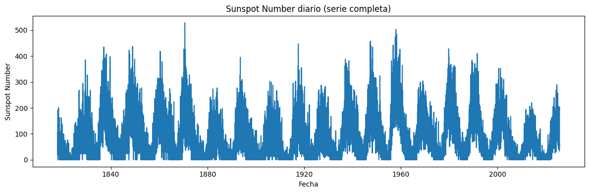
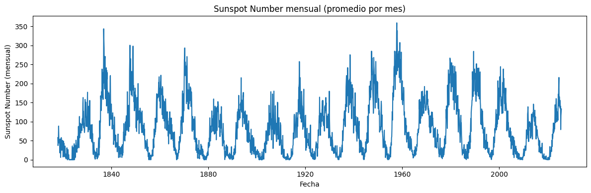
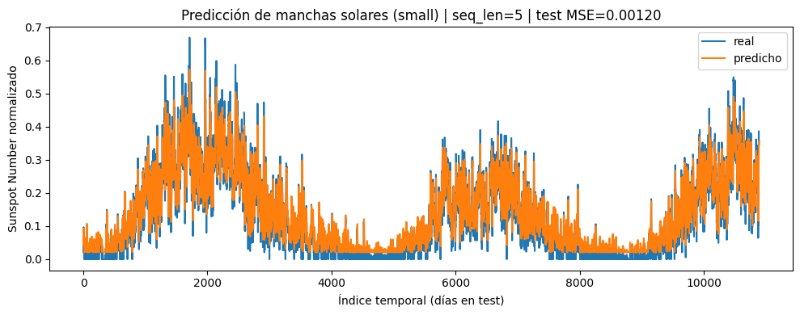
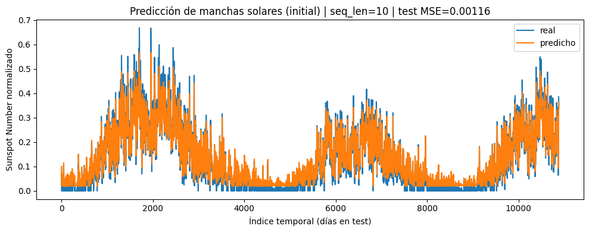
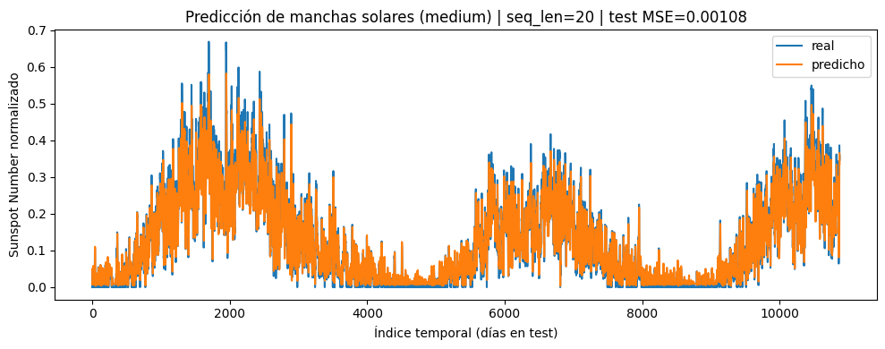
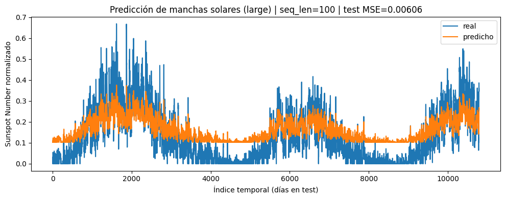

# RNN para Sunspots (SIDC)

## Descripción del dataset

El dataset utilizado corresponde al **Daily total sunspot number (versión 2.0)**, disponible en el sitio oficial del **WDC-SILSO, Royal Observatory of Belgium**:

- [Sunspot Number Dataset – SIDC](https://www.sidc.be/SILSO/datafiles)

Este archivo contiene el número total diario de manchas solares calculado con la fórmula:

$$
R = N_s + 10 \times N_g
$$

donde:

- $N_s$ = número de manchas individuales.
- $N_g$ = número de grupos de manchas solares observados en todo el disco solar.

El rango temporal disponible va desde el **1 de enero de 1818** hasta el mes más reciente (con valores provisionales en los últimos 3–6 meses). Antes de 1818 no se incluyen datos diarios, ya que las observaciones eran demasiado escasas y se recopilan solo promedios mensuales o anuales.

Un ejemplo de línea del archivo CSV es:

```bash
1818;01;01;1818.001; -1; -1.0; 0;1
```

### Significado de las columnas

1. **Año** -> año de la observación (ejemplo: 1818).
2. **Mes** -> mes de la observación (ejemplo: 01).
3. **Día** -> día de la observación (ejemplo: 01).
4. **Fecha fraccionaria** -> año expresado en formato decimal (ejemplo: 1818.001 representa aproximadamente el 1 de enero de 1818).
5. **Número diario total de manchas solares** -> valor positivo indica el número estimado de manchas solares. El valor `-1` marca un dato faltante.
6. **Desviación estándar diaria** -> dispersión de los valores individuales reportados por distintas estaciones.
7. **Número de observaciones** -> cuántas estaciones contribuyeron a calcular el valor diario.
8. **Indicador definitivo/provisional** -> `1` indica que el valor es definitivo; `0` significa que es provisional y aún puede ser revisado.

## Capa investigada — `torch.nn.RNN`

**Input esperado.** Tensor con forma `(batch, seq_len, input_size)` usando `batch_first=True`.

**Output.**

- `output`: secuencia de estados ocultos con forma `(batch, seq_len, D*hidden_size)`, donde `D=1` al ser unidireccional.
- `h_n`: último estado por capa y dirección con forma `(num_layers*D, batch, hidden_size)`.

**Parámetros usados.** `input_size=1`, `hidden_size=16`, `num_layers=1`, `batch_first=True`.

**Notas.** Con una sola capa el `dropout` interno de `nn.RNN` no entra en juego; `bidirectional` queda en `False` por defecto.

## Metodología

- **Ventanas** se usaron las longitudes 5, 10, 20 y 100.
- **Modelo:** `nn.RNN` seguida de una capa lineal de salida.
- **Entrenamiento:** pérdida MSE, optimizador Adam (1e-2), 50 épocas.
- **Preparación de datos:** partición temporal en train/valid/test; visualización de la serie diaria y su promedio mensual antes del modelado.

## Resultados

| Ventana | seq_len | Train MSE (ep50) | Val MSE (ep50) | **Test MSE** |  **Tiempo** | grad_norm (ep50) |
| ------- | -------: | ---------------: | -------------: | -----------: | ----------: | ----------------: |
| small   |        5 |         0.002734 |       0.001850 | **0.001200** |  **0.70 s** |             0.055 |
| initial |       10 |         0.002636 |       0.001834 | **0.001156** |  **1.37 s** |             0.016 |
| medium  |       20 |         0.002693 |       0.001844 | **0.001076** |  **2.89 s** |             0.040 |
| large   |      100 |         0.008931 |       0.008487 | **0.006062** | **15.23 s** |             0.057 |

- **Mejor desempeño: ventana 20.**
  
  Obtiene el **menor error en test**. Con 20 pasos la RNN ve suficiente historia para ubicar fase y amplitud del ciclo sin caer en sobre–suavizado. El grad_norm se mantiene bajo (0.040), lo que indica entrenamiento estable.

- **Segundo lugar: ventana 10.**
  
  Error muy cercano al de 20. Menos contexto, pero suficiente para seguir los ciclos; además, **casi 2× más rápida** que 20. Buena opción cuando el tiempo de entrenamiento importa.

- **Tercer lugar: ventana 5.**
  
  Sube un poco el error. La red captura cambios inmediatos pero pierde parte de la forma global del ciclo, lo que se traduce en más “nerviosismo” y ligeros desfases. A favor: es la **más rápida**.

- **Peor desempeño: ventana 100.**
  
  **Mayor error** y **mayor tiempo**. Con tantos pasos, la RNN simple (1 capa, hidden=16) tiende a promediar la señal: picos subestimados y valles sobreestimados. El grad_norm no explota (0.057), así que no hay inestabilidad numérica; el problema es **capacidad/optimización** y **desvanecimiento del gradiente** al retropropagar a través de secuencias largas.

### Comparaciones

- **20 vs 10:** 20 ofrece el **mejor MSE**; 10 sacrifica una fracción mínima de precisión a cambio de **\~2× menos tiempo**.
- **10/20 vs 5:** 5 pierde contexto histórico y eso eleva el error; aun así, el salto de MSE es pequeño, así que resulta una alternativa si se prioriza velocidad.
- **100 vs todos:** se ve una regresión en precisión y costo temporal muy superior; no compensa con esta arquitectura.

El punto "bueno" está entre **10 y 20 pasos**: buen balance entre contexto, precisión y costo. **5** está también biensi se optimiza por tiempo. **100** no es recomendable con RNN simple; para ventanas tan largas se requerirían cambios de arquitectura (LSTM/GRU), mayor `hidden_size`.

## Visualizaciones

### Serie completa (exploración)



Serie diaria del Sunspot Number: se observan ciclos de \~11 años con picos asimétricos y periodos de mínima actividad cercanos a 0; evidencia estacionalidad marcada y mayor variabilidad en los máximos.



Serie mensual (promedio por mes): al promediar la señal diaria se atenúa el ruido de alta frecuencia y se resaltan la periodicidad, la fase y la amplitud del ciclo solar, facilitando la lectura de los cambios a largo plazo.

### Predicción vs real (segmento de prueba)

#### Predicción con ventana 5



*La secuencia predicha sigue bien los cambios rápidos del ciclo, con poco retraso temporal. A cambio, aparece más “serrucho”: la señal se vuelve nerviosa y los picos quedan algo desalineados. Refleja un modelo que prioriza variaciones locales sobre la forma global del ciclo (MSE=0.00120).*

#### Predicción con ventana 10



*Compromiso claro entre detalle y suavizado: la fase del ciclo y la amplitud resultan cercanas a la serie real sin introducir demasiado ruido. Los extremos se reproducen mejor que con ventana 5 y se mantiene un buen seguimiento de subidas y bajadas (MSE=0.00116).*

#### Predicción con ventana 20



*La forma del ciclo se preserva con el menor desfase y una amplitud más realista: picos y valles quedan mejor ubicados y la señal predicha no se “aplana”. Es el mejor equilibrio observado entre memoria histórica y precisión punto a punto (MSE=0.00108).*

#### Predicción con ventana 100



*La salida se sobre–suaviza: picos subestimados, valles sobreestimados y mayor retraso de fase. El modelo termina promediando demasiada historia y pierde contraste, lo que se traduce en un error sensiblemente mayor (MSE=0.00606).*

> En todas las figuras, **azul = real** y **naranja = predicho** sobre la serie **normalizada**; el eje x es el índice temporal (días) del conjunto de prueba.

## Referencias

- [RNN Documentation (PyTorch)](https://docs.pytorch.org/docs/stable/generated/torch.nn.RNN.html)
- [LSTM Documentation (PyTorch)](https://docs.pytorch.org/docs/stable/generated/torch.nn.LSTM.html)
- [Dataset Sunspots (WDC-SILSO)](https://www.sidc.be/SILSO/datafiles)
- [Información detallada del dataset diario (SILSO)](https://www.sidc.be/SILSO/infosndtot)
